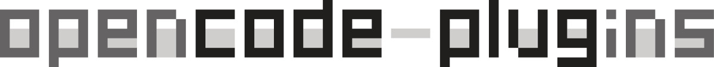

<p align="center">
<p align="center">
  <a href="https://github.com/capybearista/opencode-plugins">
    <picture>
      <source srcset=".github/assets/opencode-plugins-dark.svg" media="(prefers-color-scheme: dark)">
      <source srcset=".github/assets/opencode-plugins-light.svg" media="(prefers-color-scheme: light)">
      
    </picture>
  </a>
</p>
<p align="center">
  <a href="https://www.npmjs.com/~capybearista"></a>
  <a href="https://github.com/capybearista/opencode-plugins/actions/workflows/ci.yml"></a>
  <a href="https://deepwiki.com/capybearista/opencode-plugins"></a>
  <a href="./LICENSE"></a>
</p>

A collection of plugins for the OpenCode AI coding agent. These extensions add quality-of-life improvements, user interface features, and new configuration standards.

## Quick Start

```sh
opencode plugin add -g \
@capybearista/opencode-output-styles \
@capybearista/opencode-agents-loader \
@capybearista/opencode-double-tap-timeline
```

## Meet The Plugins

### 🗣️ [@capybearista/opencode-output-styles](./packages/opencode-output-styles/)
Persistent response styles for OpenCode sessions. This plugin injects selected guidelines (like "explanatory" or "learning" modes) into the system prompt so they stay active across your session.

### 🛠️ [@capybearista/opencode-agents-loader](./packages/opencode-agents-loader/)
Extends command and agent discovery to the `.agents/` directory standard. This enables interoperability with other AI tools and keeps project configuration organized.

### ⏱️ [@capybearista/opencode-double-tap-timeline](./packages/opencode-double-tap-timeline/)
A keyboard-driven UI extension. Double-tap the Escape key to instantly open the session timeline modal without typing commands or using a mouse.

## Installation

You can install any of these plugins globally or locally using the OpenCode CLI:

```bash
opencode plugin add -g @capybearista/opencode-output-styles
opencode plugin add @capybearista/opencode-output-styles
```

Alternatively, add them directly to your `opencode.json`/`opencode.jsonc` configuration file:

```json
{
  "plugin": [
    "@capybearista/opencode-output-styles",
    "@capybearista/opencode-agents-loader"
  ]
}
```

For TUI-based plugins, add them directly to `tui.json`/`tui.jsonc`:

```json
{
  "plugin": [
    "@capybearista/opencode-double-tap-timeline"
  ]
}
```

## What Should I Build Next?

Every plugin here started because someone hit a wall with OpenCode and thought *"there's gotta be a better way."*

I usually browse through [Reddit](https://reddit.com/r/opencodecli) and the GitHub Issues section of the [OpenCode](https://github.com/anomalyco/opencode) repo, noticing people griping about their workflows. But if you've got a concrete idea and want to put it directly in front of me, I'm all ears :)

<span>&#8611;</span> [GitHub Discussions](https://github.com/capybearista/opencode-plugins/discussions) for plugin brainstorms, OpenCode pain points, and "what if..." ideas.

<span>&#8611;</span> Already using a plugin and something's off? Or maybe you've got an idea to enhance an existing plugin? [Open an issue](https://github.com/capybearista/opencode-plugins/issues).

## Development

This project is a monorepo managed with Bun and Turborepo.

```bash
# Install dependencies
bun install

# Build all plugins
bun run build

# Run tests
bun run test
```

## License

[MPL-2.0](./LICENSE.md)
