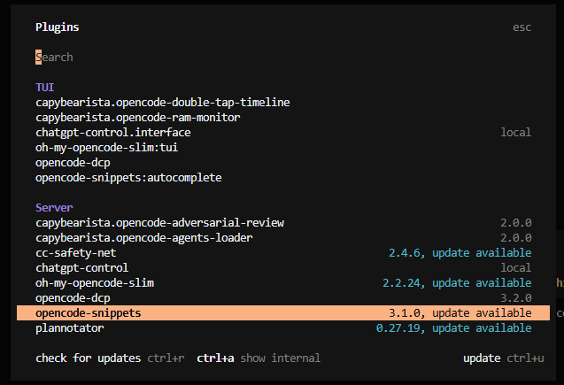

<p align="center">
<p align="center">
  <a href="https://github.com/capybearista/opencode-plugins">
    <picture>
      <source srcset=".github/assets/opencode-plugins-dark.svg" media="(prefers-color-scheme: dark)">
      <source srcset=".github/assets/opencode-plugins-light.svg" media="(prefers-color-scheme: light)">
      
    </picture>
  </a>
</p>
<p align="center">
  <!-- <a href="https://www.npmjs.com/package/@capybearista/opencode-plugins"></a> -->
  <a href="https://www.npmjs.com/~capybearista"></a>
  <a href="https://opencode.ai"></a>
  <a href="https://opensource.org/licenses/MPL-2.0"></a>
</p>
<p align="center">
  <a href="https://github.com/capybearista/opencode-plugins/actions/workflows/ci.yml"></a>
  <a href="https://deepwiki.com/capyBearista/opencode-plugins"></a>
</p>

A collection of plugins for the OpenCode AI harness. These extensions add quality-of-life improvements, user interface features, and new configuration standards.

## Meet The Plugins

### 🤺 [opencode-adversarial-review](./packages/opencode-adversarial-review/)

Two clean-context code reviewers that stay unbiased by conversation history: an adversarial reviewer that challenges your implementation approach and design choices, prioritizing auth gaps, data loss, and similar risks (structured JSON findings with severity, confidence, and recommendations), plus a constructive reviewer that checks correctness first and suggests improvements. *Inspired by Codex*

### 🛠️ [opencode-agents-loader](./packages/opencode-agents-loader/)

Extends **command** and **agent** discovery to the `.agents/` directory standard. This enables interoperability with other AI tools and keeps project configuration organized.

### ⏱️ [opencode-double-tap-timeline](./packages/opencode-double-tap-timeline/)

A keyboard-driven UI extension. Double-tap the Escape key to instantly open the session timeline modal without typing commands or using a mouse. *Inspired by Claude Code*

### 🐏 [opencode-ram-monitor](./packages/opencode-ram-monitor/)

Zero-dependency RAM monitoring for OpenCode sessions. Shows live session memory usage in the sidebar and adds a `/ram` command for a detailed process tree and aggregate OpenCode RAM totals.

### 💬 [opencode-agent-prompt-inheritance](./packages/opencode-agent-prompt-inheritance/)

Preserves provider system prompts when custom agents add their own instructions, stitching the base provider prompt and the custom agent prompt together instead of discarding base model behaviors.

### 🗣️ [opencode-output-styles](./packages/opencode-output-styles/)

Persistent response styles for OpenCode sessions. This plugin injects selected guidelines (like "explanatory" or "learning" modes) into the system prompt so they stay active across your session. *Inspired by Claude Code*

## Compatibility and release status

| Plugin | Pin Version for V2; Where | Pin Version for V1; Where |
| --- | --- | --- |
| `opencode-adversarial-review` | `@latest` in `opencode.json(c)` | `@1.0.0` in `opencode.json(c)` |
| `opencode-agents-loader` | `@latest` in `opencode.json(c)` | `@1.0.0` in `opencode.json(c)` |
| `opencode-double-tap-timeline` | `@latest` in `cli.json(c)` | `@1.0.1` in `tui.json(c)` |
| `opencode-ram-monitor` | `@latest` in `opencode.json(c)` and/or `cli.json(c)` | `@1.1.0` in `opencode.json(c)` and `tui.json(c)` |
| `opencode-agent-prompt-inheritance` | V1 only; V2 port TBD | `@1.0.0` in `opencode.json(c)` |
| `opencode-output-styles` | V1 only; V2 unplanned |  `@1.0.1` in `opencode.json(c)` |

## Installation

### OpenCode V2

V2 uses a plural `"plugins"` key.

Server profile. Add to `opencode.json(c)`:

```json
{
  "$schema": "https://opencode.ai/config.json",
  "plugins": [
    "@capybearista/opencode-adversarial-review@latest",
    "@capybearista/opencode-agents-loader@latest",
    "@capybearista/opencode-ram-monitor@latest"
  ]
}
```

TUI profile. Add to `cli.json`:

```json
{
  "$schema": "https://opencode.ai/v2/cli.json",
  "plugins": [
    "@capybearista/opencode-double-tap-timeline@latest",
    "@capybearista/opencode-ram-monitor@latest"
  ]
}
```

### Updating

There are two ways to update configured plugins. Either way, only mutable targets
(such as `@latest`) are updated: exact pins stay fixed.

1. **TUI plugin manager.** Open the plugins dialog from the TUI (the "Open plugins" action, or click the plugin status in the footer). It lists every configured plugin with its status and offers check (`ctrl+r`), update (`ctrl+u`), and install actions.

[](https://opencode.ai/v2/docs/plugins/)

2. **CLI.** `opencode plugin check` reports available updates without installing them. `opencode plugin update` with the configured target as its argument updates that plugin; omitting the target updates all configured mutable targets:
```bash
opencode plugin check
opencode plugin update @capybearista/opencode-ram-monitor
```

### OpenCode V1

Use these instructions for OpenCode V1. V1 uses the singular `"plugin"` key. The examples below use the current V1 package versions.

Server profile. Add to `opencode.json(c)`:

```json
{
  "plugin": [
    "@capybearista/opencode-adversarial-review@1.0.0",
    "@capybearista/opencode-agent-prompt-inheritance@1.0.0",
    "@capybearista/opencode-agents-loader@1.0.0",
    "@capybearista/opencode-output-styles@1.0.1",
    "@capybearista/opencode-ram-monitor@1.1.0"
  ]
}
```

TUI profile. Add to `tui.json(c)`:

```json
{
  "plugin": [
    "@capybearista/opencode-double-tap-timeline@1.0.1",
    "@capybearista/opencode-ram-monitor@1.1.0"
  ]
}
```

#### Updating V1 installations

V1 reuses the cached installation for an already configured target; a restart alone does not fetch
a newer package. To move an actively maintained V1 plugin to another release, choose a different
exact version and use `opencode plugin --force <package>@<version>` to replace the configured
entry. `--force` changes configuration; it does **not** refresh the cache for the same `@latest`
specifier.

If that does not work, check and delete the respective plugin's directory within OpenCode's cache:

```sh
ls ~/.cache/opencode/packages/@capybearista/
```
Then
```sh
rm -rf ~/.cache/opencode/packages/@capybearista/<plugin directory>
```
This will force OpenCode to download the pinned version of the plugin on its next restart.

## What Should I Build Next?

Every plugin here started because someone hit a wall with OpenCode and thought _"there's gotta be a better way."_

I usually browse through [Reddit](https://reddit.com/r/opencodecli) and the GitHub Issues section of the [OpenCode](https://github.com/anomalyco/opencode) repo, noticing people griping about their workflows. But if you've got a concrete idea and want to put it directly in front of me, I'm all ears :)

<span>&#8611;</span> Got a brand-new plugin idea? [Open a plugin proposal issue](https://github.com/capybearista/opencode-plugins/issues/new?template=new_plugin_proposal.yml).

<span>&#8611;</span> Already using a plugin and something's off? Or maybe you've got an idea to enhance an existing plugin or the monorepo itself? [Open a feature request issue](https://github.com/capybearista/opencode-plugins/issues/new?template=feature_request.yml).

## Shoutouts

Plugins I've personally used and highly recommend! Some of these are genuinely underrated and have massive potential.

| Name                                                                             | Use case                                                         | Description                                                                                                                                                                        |
| -------------------------------------------------------------------------------- | ---------------------------------------------------------------- | ---------------------------------------------------------------------------------------------------------------------------------------------------------------------------------- |
| [opencode-quota](https://github.com/slkiser/opencode-quota)                      | Keep track of your provider subscriptions _in_ OpenCode          | Token usage and quota tracking for Anthropic, OpenAI, Copilot, and more—reports in terminal with zero context pollution.                                                           |
| [opencode-snippets](https://github.com/JosXa/opencode-snippets)                  | Expand `#tags` into text anywhere, instantly                     | Hashtag-based snippet expansion. Just type `#name` to inject pre-defined code blocks, configs, or prompts inline. You can even put them in commands.                               |
| [opencode-dynamic-context-pruning](https://github.com/Opencode-DCP/opencode-dynamic-context-pruning) | Caps token waste from stale context                              | Context-aware compression intelligently prunes old tool outputs to keep context lean and reduce token burn.                                                                        |
| [cc-safety-net](https://github.com/kenryu42/claude-code-safety-net)              | Prevents dangerous commands like `rm -rf` and `git reset --hard` | Intercepts destructive git and filesystem commands before they execute, giving you a chance to abort before your agent deletes your entire project.                                |
| [opencode-agent-identity](https://github.com/gotgenes/opencode-agent-identity)   | Distinguish which sub-agent said what in multi-agent sessions    | Per-message attribution so each agent knows its role and which message came from which source.                                                                                     |

## Development

This project is a monorepo managed with Bun and Turborepo. The canonical toolchain uses Bun
**1.3.12**.

```bash
# Install dependencies
bun install --frozen-lockfile

# Build all plugins before local-entrypoint or artifact checks
bun run build

# Run the canonical Turbo test pipeline
bun run test

# Typecheck and lint the workspace
bun run typecheck
bun run lint
```

Do not use bare `bun test` from the repository root as the canonical check; `bun run test` is
the Turbo pipeline and includes the root release guard. A package-scoped `bun test` is valid when
run from that package directory. `bun run check` runs Biome with `--write`, so it mutates files and
should only be used when formatting changes are intended.

Read the [documentation index](./docs/README.md), [V1 plugin guide](./docs/v1-plugins.md) (if developing for OpenCode V1), and
[contribution guidelines](./CONTRIBUTING.md) before contributing.

## Disclaimer

This project is not affiliated with the anomalyco/opencode team in any way. These plugins are independently developed and maintained. I do this for the love of the game ¯\\_(ツ)_/¯

## License

[MPL-2.0](./LICENSE.txt)
