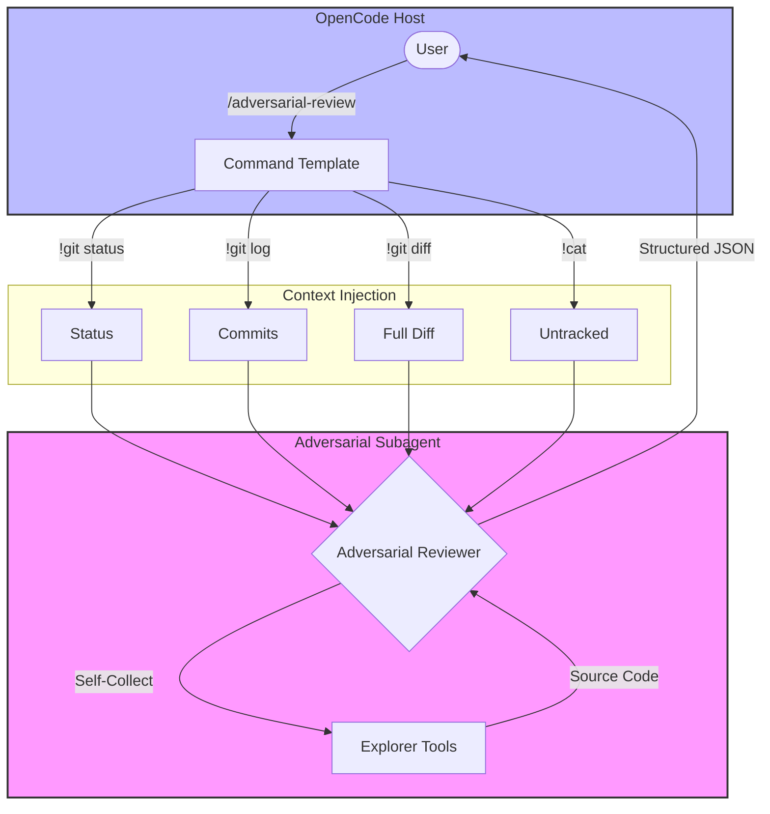

# opencode-adversarial-review

<p align="center">Unbiased challenges and reviews for your code</p>
<p align="center">
  <a href="https://www.npmjs.com/package/@capybearista/opencode-adversarial-review"></a>
  <a href="https://www.npmjs.com/package/@capybearista/opencode-adversarial-review"></a>
  <a href="https://opencode.ai"></a>
  <a href="https://opensource.org/licenses/MPL-2.0"></a>
</p>

---

## Why?

> Provides an adversarial code review agent that challenges implementation approach and design choices, not just finding bugs. Uses a clean-context subagent so the review is unbiased by conversation history.

## Philosophy: Extending OpenCode

OpenCode is designed to be highly extensible. This plugin hooks into the OpenCode lifecycle to provide additional functionality seamlessly into your workflows. This plugin is modeled after the Codex CLI's adversarial review system, focusing on "breaking confidence" rather than validating changes.

### Architecture



The plugin uses a **stateless subagent architecture**. When the command is invoked, the plugin collects the branch, status, recent commits, the full diff against `HEAD`, and the full text contents of unignored untracked files, then injects them into a fresh reviewer session. This ensures the review is unbiased by the primary agent's conversation history.

## Features

- **Adversarial Persona**: A specialized subagent prompted to find reasons *not* to ship, prioritizing auth gaps, race conditions, and data loss.
- **Complete Context Collection**: Inlines the entire diff against `HEAD` and the full text contents of unignored untracked files — no truncation.
- **Subagent Self-Collection**: The reviewer uses whitelisted read-only git and file tools to pull surrounding code or branch-scope diffs it still needs.
- **Structured JSON Output**: Returns findings with severity, file locations, confidence scores, and concrete recommendations.
- **Configurable Scope**: Support for `--base <ref>`, `--scope branch`, and `--scope working-tree`.

## Install

Add the plugin to `opencode.json` or `opencode.jsonc`:
```json
{
  "plugin": ["@capybearista/opencode-adversarial-review@latest"]
}
```

You can also install it through the CLI:

```bash
opencode plugin -g @capybearista/opencode-adversarial-review@latest    # global install
opencode plugin @capybearista/opencode-adversarial-review@latest    # project-local install
```

## Updating

Simply run the following command while no active OpenCode sessions are running:

```bash
rm -rf ~/.cache/opencode/packages/'opencode-adversarial-review@latest'/
```

The next time you open OpenCode, the new version will be installed!

## Usage

Run a review on your current working tree changes:
```bash
/adversarial-review
```

### Arguments

| Argument | Values | Description |
| :--- | :--- | :--- |
| `--scope` | `auto`, `working-tree`, `branch` | The range of changes to review. Defaults to `auto`. |
| `--base` | `<git-ref>` | The base reference (branch or commit) to compare against when using `branch` scope. |

- **`auto`**: Reviews the working tree when it has staged or unstaged changes; otherwise reviews the current branch.
- **`working-tree`**: Reviews staged and unstaged changes against `HEAD`.
- **`branch`**: Reviews all changes on the current branch since it diverged from the upstream or main branch.
- **`focus ...`**: Any trailing text is treated as a focus area for the review.

### Examples

Force review of only working tree changes (ignoring branch history):
```bash
/adversarial-review --scope working-tree
```

Review all changes on the current branch (automatically finds the fork point):
```bash
/adversarial-review --scope branch
```

Review a specific branch against its fork point from `main`:
```bash
/adversarial-review --base main
```

Review with a specific focus area:
```bash
/adversarial-review --base main focus on race conditions in the auth middleware
```

## Configuration

| Property | Type | Description |
| :--- | :--- | :--- |
| `options.model` | `string` | Model override for the review (`provider/id`, optional `#variant`). Defaults to the invoking session's model. |

This plugin requires no manual configuration out of the box. The reviewer inherits the invoking session's model; set the plugin `model` option to override it. The review temperature is pinned to `0.1` by the plugin's session hooks, and the Git context is collected programmatically, so there is no agent or command template to configure.

## Permissions & Security

This plugin is designed with a "least privilege" security model. The adversarial subagent is strictly sandboxed to prevent accidental or malicious modifications to your codebase:

- **Edit**: Explicitly denied (`edit: deny`).
- **Bash**: Restricted to a read-only whitelist of 12 Git patterns (e.g., `git diff`, `git log`, `git status`). All other shell commands are blocked.
- **Read/Grep/Glob**: Allowed (read-only) to enable code inspection.
- **Network**: Web fetch and search are disabled to ensure the review remains focused on the files at hand.

The `/adversarial-review` command is the only supported and unbiased path. The reviewer is hidden and its description tells agents not to invoke it directly; a direct spawn is still technically possible, but it is unsupported and caller-controlled.

### Context disclosure

Invoking `/adversarial-review` consents to sending the review context to the reviewer model: the complete diff against `HEAD` and the full text contents of unignored untracked files. The plugin does not scan for secrets, so check your `.gitignore` and your tracked files before running it on a tree that contains them. Direct reads of `.env` and `.env.*` files are denied to the reviewer; `.env.example` remains readable.

## Troubleshooting

- **"No changes to review"**: Ensure you have staged or unstaged changes, or use `--base` to review a committed branch.
- **Model timeouts**: Large diffs may require a model with a larger context window or more time. The reviewer can also read files with its tools while it works.
- **Git errors**: Ensure you are running within a git repository. The command relies on `git` being available in your PATH.

## Contributing

This package lives in the `opencode-plugins` monorepo.

- Run `bun run build`, `bun run typecheck`, `bun run lint`, and `bun test` before opening a PR.
- Keep the plugin focused on the adversarial code review function.
- Prefer small, direct changes.

Please open an issue or check for existing ones before creating a pull request.

## License

[MPL-2.0](./LICENSE.txt)
