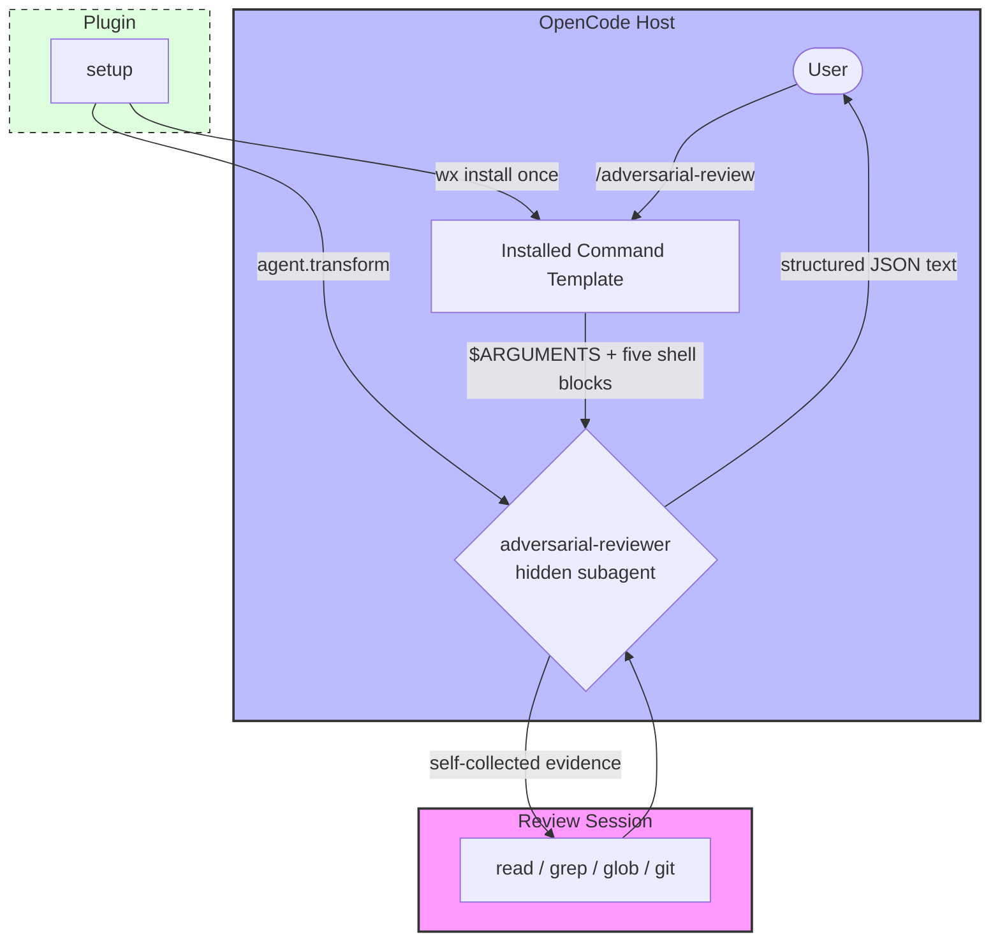

# opencode-adversarial-review

<p align="center">Unbiased challenges and reviews for your code</p>
<p align="center">
  <a href="https://www.npmjs.com/package/@capybearista/opencode-adversarial-review"></a>
  <a href="https://www.npmjs.com/package/@capybearista/opencode-adversarial-review"></a>
  <a href="https://opencode.ai"></a>
  <a href="https://opensource.org/licenses/MPL-2.0"></a>
</p>

---

## Why?

> Provides an adversarial code review agent that challenges implementation approach and design choices, not just finding bugs. Uses a clean-context subagent so the review is unbiased by conversation history.

## Philosophy: Extending OpenCode

OpenCode is designed to be highly extensible. This plugin hooks into the OpenCode lifecycle to provide additional functionality seamlessly into your workflows. This plugin is modeled the Codex CLI's adversarial review system, focusing on "breaking confidence" rather than validating changes.

### Architecture

The plugin owns the reviewer agent and installs the command that routes to it:

- **Agent (in memory)**: setup registers the hidden `adversarial-reviewer` subagent through `agent.transform`. Nothing is written to your agents directory.
- **Command (on disk)**: setup installs `commands/adversarial-review.md` from the packaged template into your OpenCode config directory. The host discovers it as `/adversarial-review` and routes it to the reviewer with `subagent: true`.
- **Prompt (packaged)**: `src/prompt.ts` and `src/prompts/adversarial-review.md` are the system prompt and its reference copy.



The reviewer runs as a linked background child of the invoking session, so the review is unbiased by the primary agent's conversation history. It collects its own evidence with read-only `read`, `grep`, `glob`, and whitelisted `git` commands; the command template only primes it with a point-in-time Git snapshot.

## Features

- **Adversarial Persona**: A specialized subagent prompted to find reasons *not* to ship, prioritizing auth gaps, race conditions, and data loss.
- **Reviewer-Collected Evidence**: The reviewer inspects changed files, untracked files, and branch-scope diffs itself with read-only tools, then reports only what it verified.
- **Auto-Installed Command**: First setup writes `/adversarial-review` into your global commands directory; the write is atomic and write-once.
- **Structured JSON Output**: The prompt asks for findings with severity, file locations, confidence scores, and concrete recommendations.
- **Configurable Scope**: Support for `--base <ref>`, `--scope branch`, and `--scope working-tree`.

## Requirements

- GNU/Linux with a Bash-compatible shell. The command template is not tested on Windows or macOS and makes no cross-platform parity claims.
- `git` on `PATH`.
- A writable `<config>/commands/` directory (see Install).

## Install

This package targets the V2 Promise plugin API (`@opencode/plugin` **2.0.2**) and exports a default `Plugin.define({ id, setup })` definition; it is not compatible with a V1 host. Add it to your V2 server profile's `opencode.json` or `opencode.jsonc` under the plural `"plugins"` key:

```json
{
  "plugins": ["@capybearista/opencode-adversarial-review@latest"]
}
```

The plugin ships a server entry only, so `cli.json` needs no entry. You can also install it through the V2 CLI:

```bash
opencode2 plugin add @capybearista/opencode-adversarial-review
```

V1 hosts use the singular `"plugin"` key and the V1 release line, not this V2 API; see the [V1 plugin guide](../../docs/v1-plugins.md) to keep the two lines apart.

On setup, the plugin installs the command file at:

```
<OPENCODE_CONFIG_DIR ?? ~/.config/opencode>/commands/adversarial-review.md
```

The parent `commands/` directory must already exist and be writable. If it is missing or unwritable, setup fails loudly and the reviewer agent is **not** registered — a registered agent with no command would be a broken setup. If the file already exists, the plugin leaves it untouched and logs a warning; the file may be stale or customized, and only you can decide which.

### Updating

Plugin upgrades never overwrite the installed command file. To pick up a new template, delete the file and restart OpenCode; setup installs the bundled version again. To keep local changes, edit the installed file in place.

Updating the plugin package itself follows the V2 flow: `opencode2 plugin check` reports available updates and `opencode2 plugin update` moves the configured target. A restart alone does not upgrade a cached target, and exact pins stay fixed. Stop active sessions first.

### Uninstall

Remove the plugin from the `"plugins"` array in `opencode.json` / `opencode.jsonc` (or run `opencode2 plugin remove @capybearista/opencode-adversarial-review`), then delete the installed command file:

```bash
rm ~/.config/opencode/commands/adversarial-review.md
```

If the plugin is still registered, the next setup reinstalls the file.

## Usage

Run a review on your current working tree changes:
```bash
/adversarial-review
```

### Arguments

| Argument | Values | Description |
| :--- | :--- | :--- |
| `--scope` | `auto`, `working-tree`, `branch` | The range of changes to review. Defaults to `auto`. |
| `--base` | `<git-ref>` | The base reference (branch or commit) to compare against when using `branch` scope. |

- **`auto`**: Reviews the working tree when it has staged or unstaged changes; otherwise reviews the current branch.
- **`working-tree`**: Reviews staged and unstaged changes against `HEAD`.
- **`branch`**: Reviews all changes on the current branch since it diverged from the upstream or main branch.
- **`focus ...`**: Any trailing text is treated as a focus area for the review.

### Examples

Force review of only working tree changes (ignoring branch history):
```bash
/adversarial-review --scope working-tree
```

Review all changes on the current branch (automatically finds the fork point):
```bash
/adversarial-review --scope branch
```

Review a specific branch against its fork point from `main`:
```bash
/adversarial-review --base main
```

Review with a specific focus area:
```bash
/adversarial-review --base main focus on race conditions in the auth middleware
```

## Configuration

The shipped command has no `model:` line. The host resolves the review model in this order:

1. `model` in the installed command file's frontmatter (add it manually to pin one),
2. `model` configured for the `adversarial-reviewer` agent in your OpenCode config,
3. the invoking session's model.

The reviewer inherits the invoking session's model when none of the above is set. The plugin also pins the review temperature to `0.1` through session hooks, scoped to the reviewer agent only. Those hooks fire for every session in the host, so the plugin logs a one-time warning per observed non-reviewer agent identity (including events with no agent) instead of skipping silently.

Structured JSON is *requested*, not enforced. The reviewer prompt asks for one verbatim JSON object, but neither the plugin nor the host validates the answer. A child run that fails reaches the parent as `state="error"`; malformed-but-completed text arrives as a normal completed message. Read the output as model text, not as a validated contract.

## Permissions & Security

The adversarial subagent is strictly sandboxed to prevent accidental or malicious modifications to your codebase:

- **Edit**: Explicitly denied (`edit`, `write`, and `patch`).
- **Shell**: Restricted to a read-only whitelist of 12 git patterns (e.g., `git diff`, `git log`, `git status`); branch access is limited to `git branch --show-current`. Diff-engine flags that execute configured drivers or write files (`--ext-diff`, `--textconv`, `--output`) are denied after the allow list for `diff`, `show`, `log`, and `stash show`. The reviewer cannot run general shell commands and cannot delegate to other subagents.
- **Read/Grep/Glob**: Allowed (read-only) to enable code inspection, except resources matching `.env`/`.env.*`, which are denied after the general allow; `.env.example` stays allowed.
- **Skills & Delegation**: `skill` activation and `subagent` delegation are denied, so the reviewer cannot chain into other capabilities.
- **Network**: Web fetch and search, and `question`, are denied; the reviewer runs unattended without ask prompts. Inherited `ask` rules are dropped at setup for the same reason — an ask would stall a background run — while the explicit allows and denies above still apply.

The `/adversarial-review` command routes to the hidden reviewer; its description tells agents not to invoke the reviewer directly. A direct spawn is still technically possible, but it is unsupported and caller-controlled.

### Shell blocks run outside the permission flow

The installed template contains five `!`-backtick blocks (branch, status, recent commits, working-tree diff, untracked file list). The host evaluates them with your shell while expanding the command, **before** the reviewer's permission rules apply. They run read-only git commands with your user's privileges in the project directory. Read the installed file before using it in an untrusted repository.

**Accepted risk — argument paste warning.** The host substitutes `$ARGUMENTS` into the template before it scans for the `!`-backtick shell blocks, so argument text can become executable shell content. `/adversarial-review` is a human-invoked surface only: typed or pasted arguments containing `!`-backtick blocks execute as shell commands with your user's privileges in the project directory. This risk is accepted and documented; no host-side fix is planned. Do not pass untrusted or pasted Markdown containing backtick blocks as arguments. Inspect the arguments before invoking, and pass only text you would type into your own shell.

### Context disclosure

Invoking `/adversarial-review` consents to sending review context to the reviewer model: a template-rendered Git snapshot (branch, status, recent commits, `git diff HEAD`, untracked file paths) plus anything the reviewer reads with its tools. The rendered snapshot is a point-in-time starting point, not a complete record: it can miss files, skip binary content, or fail to render, and the reviewer is instructed to verify with its own tools. The plugin does not scan for secrets; check your `.gitignore` and tracked files before running a review on a tree that contains them. Reads, greps, and globs whose permission resource matches `.env` or `.env.*` are denied to the reviewer; `.env.example` remains allowed.

## Troubleshooting

- **Setup failed with "Unable to install the /adversarial-review command"**: Create the `commands/` directory under your OpenCode config directory (or fix its permissions), then restart. The reviewer is not registered until the command file installs.
- **The command file warning says "leaving it untouched"**: The file already exists. Edit it in place to keep local changes, delete it to reinstall the bundled template, or delete it after removing the plugin to finish an uninstall.
- **The command file remains after uninstalling the plugin**: Plugin removal does not delete it. Delete it manually (see Uninstall) so the host stops discovering `/adversarial-review` with no reviewer agent behind it.
- **The temperature hook warns about a non-reviewer agent**: Expected. The hooks run host-wide and pin `0.1` only for `adversarial-reviewer` events; the warning is emitted once per observed agent identity.
- **"No changes to review"**: Ensure you have staged or unstaged changes, or use `--base` to review a committed branch.
- **Model timeouts**: Large diffs may require a model with a larger context window or more time. The reviewer can also read files with its tools while it works.
- **Git errors**: Ensure you are running within a git repository. The template relies on `git` being available in your PATH.

## Contributing

This package lives in the `opencode-plugins` monorepo.

- Run `bun run build`, `bun run typecheck`, `bun run lint`, and `bun test` before opening a PR.
- Keep the plugin focused on the adversarial code review function.
- Prefer small, direct changes.

Please open an issue or check for existing ones before creating a pull request.

## License

[MPL-2.0](./LICENSE.txt)
