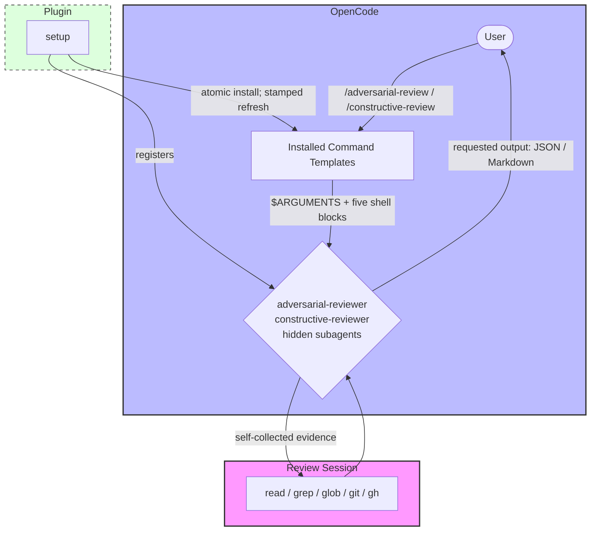

# opencode-adversarial-review

<p align="center">Unbiased challenges and reviews for your code</p>
<p align="center">
  <a href="https://www.npmjs.com/package/@capybearista/opencode-adversarial-review"></a>
  <a href="https://www.npmjs.com/package/@capybearista/opencode-adversarial-review"></a>
  <a href="https://opencode.ai"></a>
  <a href="https://opensource.org/licenses/MPL-2.0"></a>
</p>

---

## Why?

> Two code review agents with a clean-context subagent each, so reviews are unbiased by conversation history: an **adversarial reviewer** that challenges approach and design choices (modeled on the Codex CLI's review system), and a general **constructive reviewer** that checks correctness first and suggests improvements.

## Philosophy: Extending OpenCode

OpenCode is designed to be highly extensible. This plugin adds adversarial and constructive review passes directly to your workflow.

### Architecture


```mermaid
graph TB
    subgraph OpenCode [OpenCode]
        User([User]) -->|"/adversarial-review / /constructive-review"| Command[Installed Command Templates]
        Command -->|"$ARGUMENTS + five shell blocks"| Reviewer
    end

    subgraph Plugin [Plugin]
        Setup[setup] -->|registers| Reviewer{"adversarial-reviewer<br/>constructive-reviewer<br/>hidden subagents"}
        Setup -->|"atomic install; stamped refresh"| Command
    end

    subgraph Review [Review Session]
        Reviewer -->|self-collected evidence| Tools[read / grep / glob / git / gh]
        Tools --> Reviewer
        Reviewer -->|"requested output: JSON / Markdown"| User
    end

    classDef opencode fill:#bbf,stroke:#333,stroke-width:2px;
    classDef plugin fill:#dfd,stroke:#333,stroke-width:1px,stroke-dasharray: 5 5;
    classDef adversary fill:#f9f,stroke:#333,stroke-width:2px;

    class OpenCode opencode;
    class Plugin plugin;
    class Review adversary;
```

One config drives two sandboxed subagents: agents register in memory and commands install to disk,

- **Agents**: setup registers the hidden `adversarial-reviewer` and `constructive-reviewer` subagents; nothing is written to your agents directory.
- **Commands**: setup installs `~/.config/opencode/commands/adversarial-review.md` and `~/.config/opencode/commands/constructive-review.md` into your OpenCode config directory.
- **Prompts**: `src/prompt.ts` holds both system prompts; `src/prompts/adversarial-review.md` and `src/prompts/constructive-review.md` are their reference copies. All review doctrine — target selection, evidence rules, output contract — lives there, never in the command templates.

## Features

- **Two reviewers**: adversarial (reasons *not* to ship) and constructive (correctness first, then suggestions).
- **Reviewer-collected evidence**: changed files, untracked files, and branch diffs are inspected with read-only tools; only verified findings are reported.
- **Auto-installed commands**: both slash commands are written on first setup; stamped files refresh on `/reload`, user-owned edits are preserved (see note below).
- **Targets**: `--scope`, `--base`, bare commit SHA, or PR URL/number on both commands.

## Install

### OpenCode V2

Add it under the `"plugins"` key in `opencode.json(c)`:

```json
{
  "plugins": ["@capybearista/opencode-adversarial-review@latest"]
}
```

Server entry only, so `cli.json` needs no entry.

### OpenCode V1

Add it under the `"plugin"` key in `opencode.json(c)`:

```json
{
  "plugin": ["@capybearista/opencode-adversarial-review@1.0.0"]
}
```

Server entry only, so `tui.json(c)` needs no entry.

See the [V1 plugin guide](../../docs/v1-plugins.md) for details.

On setup, both command files install at `~/.config/opencode/commands/{adversarial-review.md,constructive-review.md}`. The directory **must already** exist; if a file cannot install, setup fails loudly and **neither** agent is registered.

### Uninstall

Remove the plugin from `"plugin(s)"` from the respective config files they were added to. Then delete both installed command files—plugin removal does not delete them, and OpenCode would otherwise keep discovering commands with no agents behind them.

## Usage

Both commands accept `--scope auto|working-tree|branch`, `--base <ref>`, a bare commit SHA, or a PR URL/number. A PR URL always wins; otherwise the first bare token decides (all-decimal → PR, 7+ hex chars with a letter → commit); an explicit target beats the flags. `/adversarial-review` treats remaining text as a focus area; `/constructive-review` ignores trailing non-flag text (no focus support).

```bash
/adversarial-review                  # working tree (or branch, if tree is clean)
/adversarial-review --scope branch   # current branch since fork point
/adversarial-review 4f2a9c1e         # a commit
/adversarial-review 42               # PR #42 (bare number; hex SHAs stay commits)
/constructive-review --scope working-tree  # constructive pass, working tree only
/constructive-review --scope branch        # constructive pass, current branch since fork point
/constructive-review 4f2a9c1e              # constructive pass, a commit
/constructive-review 42                    # constructive pass, PR #42
```

> [!NOTE]
> The installed command files are managed via a `managed_version` stamp in their frontmatter. Keep the stamp and the file refreshes from the bundled template on `/reload`; remove it to take ownership — the file is then left untouched with a warning. Unknown or newer stamps are likewise preserved (downgrades never clobber). A failure partway can leave the first file as a harmless orphan; it is reconciled on the next `/reload`, and registration still waits for both files. Delete a file and `/reload` to force-reinstall; uninstall the plugin *and* delete both files to fully remove the commands.
>
> The same ownership rule cleans up an upgrade leftover: a pre-rename build installed the second command as `commands/review.md` with `agent: reviewer`, an agent this version no longer registers, so OpenCode discovers it as a broken `/review`. Setup removes that exact file only when it carries `agent: reviewer` plus a `managed_version` stamp this build knows; any other `review.md` is preserved, with a warning when it carries the old agent id. Setup never deletes a file on a failed refresh unless its `O_TRUNC` open already ran — an unreadable/unwritable managed file is left intact and setup fails loudly instead.

## Configuration

Nothing is pinned — model and temperature are both inherited. Resolution order for the model: frontmatter `model` (add manually to pin) → agent `model` in OpenCode config → invoking session's model, with its temperature. To pin a reviewer model, set it in `opencode.json`/`opencode.jsonc`:

```jsonc
{
  "agents": {
    "adversarial-reviewer": { "model": "openrouter/openai/gpt-6-sol" },
    "constructive-reviewer": { "model": "openrouter/openai/gpt-6-sol" }
  }
}
```

## Permissions & Security

Both reviewers are sandboxed and unattended; the single accepted risk is pasted arguments (below). Details:

**Pasted arguments become executable template content.** `$ARGUMENTS` is substituted before the snapshot blocks run, so argument text can execute as shell. Inspect arguments before invoking, and never pass untrusted or pasted Markdown containing backtick blocks.

One shared sandbox: `edit`/`write`/`patch`, `subagent`, `skill`, `webfetch`/`websearch`, `question` denied (zero ask — reviewers run unattended); shell limited to 13 read-only `git` patterns plus `gh pr view*`/`gh pr diff*` and the `gh auth status*` diagnostic (token-printing and all other `gh` denied); `read`/`grep`/`glob` allowed except `.env`/`.env.*` (`.env.example` allowed, as is `git show <rev>:<path>` of a `.env.example` blob). See `AGENTS.md` for the full rule inventory.

## Troubleshooting

- **Setup failed installing a command file**: create (or fix permissions on) `<config>/commands/`, then `/reload`. A readable-but-unwritable managed file is left untouched, never deleted.
- **"Leaving it untouched" warning**: the file is user-owned or carries an unknown/newer stamp — edit in place, or delete to reinstall.
- **Broken `/review` after upgrading**: a pre-rename build's `commands/review.md` references the removed `reviewer` agent. Setup removes it when it carries a known stamp; an unstamped copy is preserved with a warning — delete that file manually.
- **File replaced on `/reload`**: it kept a known stamp and was refreshed; remove the stamp to take ownership.
- **"No changes to review"**: stage changes or pass `--base`.
- **PR target fails**: needs authed `gh`; the reviewer reports that plainly (stderr verbatim on failure).
- **Large diffs**: use a model with a bigger context window; reviewers also read files as they work.
- **Not a git repo**: the template needs `git` on `PATH` inside a repository.

## Contributing

This package lives in the `opencode-plugins` monorepo.

See the [contribution guidelines](../../CONTRIBUTING.md) before opening a pull request.

- From the monorepo root, run `bun run build` before artifact checks, then `bun run typecheck`,
  `bun run lint`, and the canonical `bun run test` Turbo pipeline. Do not use bare root `bun test`
  as the workspace check.
- For a focused run, `bun test` is supported from this package directory; its tests include the
  real local-directory resolver regression.
- `bun run check` writes Biome changes; use it only when formatting changes are intended.
- Prefer small, direct changes.

Please open an issue or check for existing ones before creating a pull request.

## License

[MPL-2.0](./LICENSE.txt)
