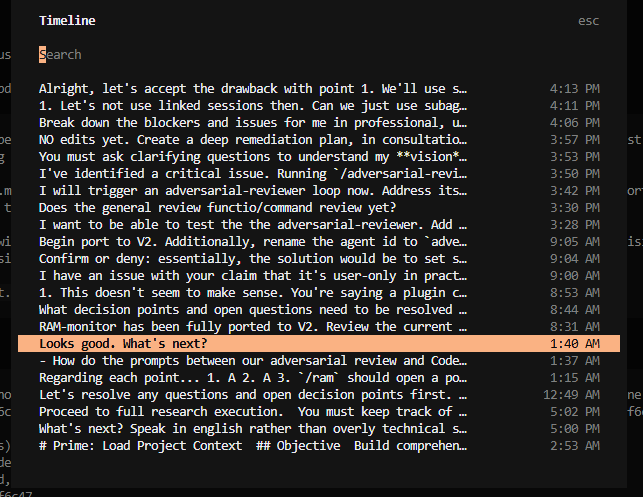
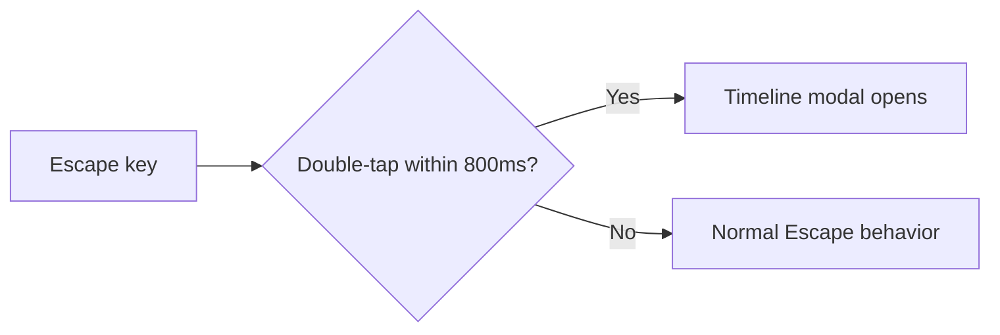

# opencode-double-tap-timeline

<p align="center">Double-tap Escape to open the timeline modal</p>
<p align="center">
  <a href="https://www.npmjs.com/package/@capybearista/opencode-double-tap-timeline"></a>
  <a href="https://www.npmjs.com/package/@capybearista/opencode-double-tap-timeline"></a>
  <a href="https://opencode.ai"></a>
  <a href="https://opensource.org/licenses/MPL-2.0"></a>
</p>

[](https://github.com/capyBearista/opencode-plugins/tree/main/packages/opencode-double-tap-timeline)

---

## Why?

> Inspired by Claude Code's double-tap-to-invoke-`/rewind` feature. Instead of typing `/timeline` or reaching for the mouse, just double-tap Escape while in a session to open the timeline modal instantly.

## Philosophy: Extending OpenCode

OpenCode is designed to be highly extensible. This plugin adds a keyboard shortcut: double-tap
`Escape` inside a session to open the timeline modal. It runs only in the TUI, detects a second
press within 800ms, leaves single presses untouched, and cleans up after itself.

### Architecture



## Features

- **Double-tap window**: detects a second press within 800ms.
- **Single-press intact**: a single Escape still works normally (cancels running model turns, closes modals as usual).

## Install

### OpenCode V2

Add it under the `"plugins"` key in `cli.json`:

```json
{
  "plugins": ["@capybearista/opencode-double-tap-timeline@latest"]
}
```

TUI entry only, so `opencode.json(c)` needs no entry.

### OpenCode V1

Add it under the `"plugin"` key in `tui.json(c)`:

```json
{
  "plugin": ["@capybearista/opencode-double-tap-timeline@1.0.1"]
}
```

TUI entry only, so `opencode.json(c)` needs no entry.

See the [V1 plugin guide](../../docs/v1-plugins.md) for details.

### Uninstall

Remove the plugin from `"plugin(s)"` from the respective config files they were added to.

## Usage

1. Open a session in OpenCode
2. Double-tap `Escape` quickly (within 800ms)
3. The timeline modal opens

**Note:** Hitting `Escape` two times in quick succession to interrupt a running prompt will also invoke the timeline modal. Hit `Escape` again to quickly exit.

## Configuration

This plugin has no plugin-specific settings. Register it under the plural `plugins` key in the
V2 TUI `cli.json` profile as shown above. It is TUI-only and must not be added to the V2 server
`opencode.json` profile.

## Troubleshooting

- If double-tap doesn't work, ensure you're in a session screen (not the home screen with the opencode logo)
- If a dialog is open, the timeline won't trigger. Close any open dialogs first

## Development Notes

Automated unit tests cover the detector, and the scoped build/static checks include the real
local-directory resolver regression without starting a provider session. In one isolated OpenCode
TUI, human verification confirmed that double-Escape opens the timeline, a single Escape keeps
native behavior, the modal-close path does not seed an unintended gesture, and the timeline action
executes.

The detector uses an 800ms window and the exact-boundary test advances the fake clock to 800ms,
runs the scheduled expiry, and then delivers the key. That is the chosen timer-first ordering; no
grace window is added. The guard is session-only and modal-aware. Key-repeat filtering is not added,
so holding Escape can count as multiple presses. Reload timing depends on OpenCode.

## Contributing

This package lives in the `opencode-plugins` monorepo.

See the [contribution guidelines](../../CONTRIBUTING.md) before opening a pull request.

- From the monorepo root, run `bun run build` before artifact checks, then `bun run typecheck`,`bun run lint`, and the canonical `bun run test` Turbo pipeline. Do not use bare root `bun test` as the workspace check.
- For a focused run, `bun test` is supported from this package directory; its tests include the real local-directory resolver regression.
- `bun run check` writes Biome changes; use it only when formatting changes are intended.
- Prefer small, direct changes.

Please open an issue or check for existing ones before creating a pull request.

## License

[MPL-2.0](./LICENSE.txt)
