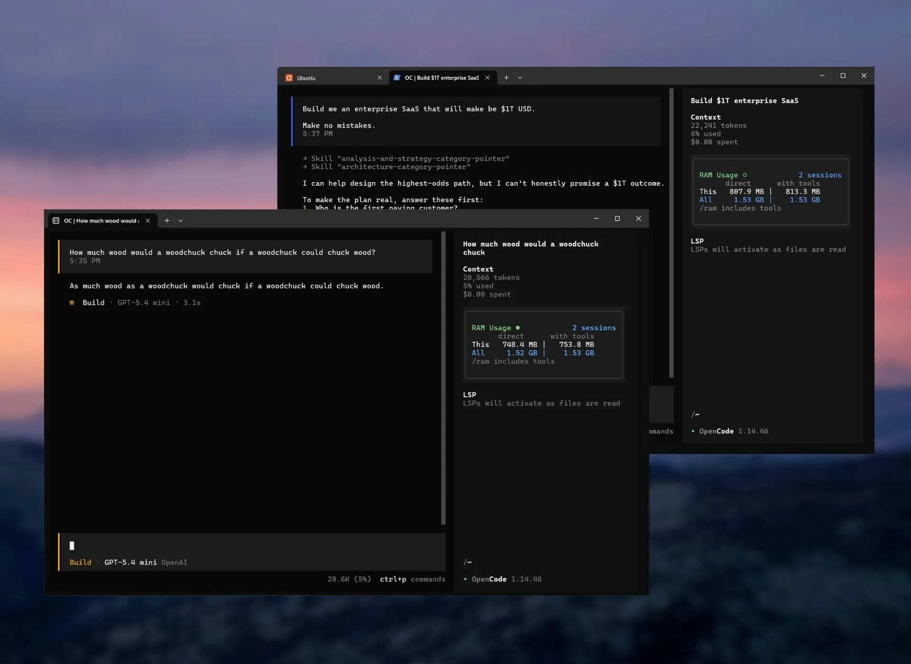
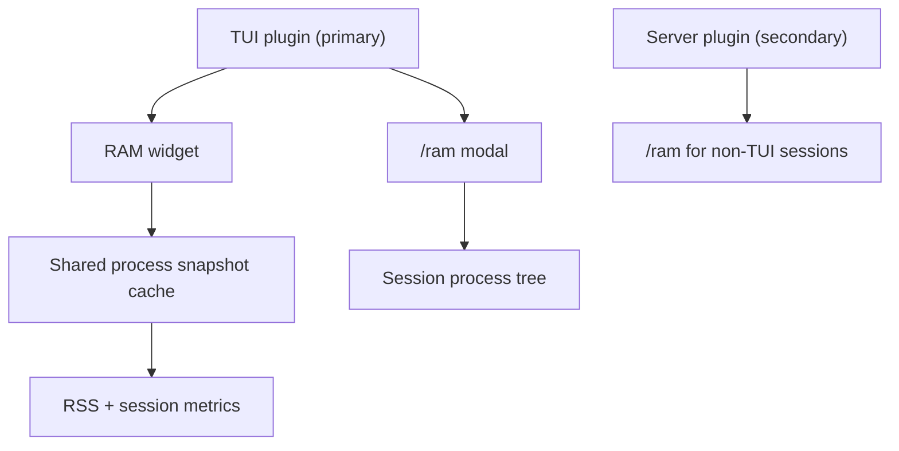

# opencode-ram-monitor

<p align="center">Zero-dependency RAM monitoring for OpenCode sessions</p>
<p align="center">
  <a href="https://www.npmjs.com/package/@capybearista/opencode-ram-monitor"></a>
  <a href="https://www.npmjs.com/package/@capybearista/opencode-ram-monitor"></a>
  <a href="https://opencode.ai"></a>
  <a href="https://opensource.org/licenses/MPL-2.0"></a>
</p>

[]([../../.github/assets/ram-monitor-sidebar.webp](https://github.com/capyBearista/opencode-plugins/tree/main/packages/opencode-ram-monitor))

---

## Why?

> This plugin gives developers real-time, zero-dependency insight into OpenCode session memory. The sidebar shows direct RSS and with-tools RSS for the current session and all sessions. The `/ram` command (and clicking the widget) opens the broader process-tree view in a pop-up.

## Philosophy: Extending OpenCode

OpenCode is designed to be highly extensible. The TUI side is the primary way to use this plugin: a sidebar slot renders a compact card, and `/ram` (or clicking the card) opens the full tree in a modal. The server side is secondary: it registers `/ram` for sessions without a TUI by injecting the tree into the session. It runs locally and falls back cleanly if process sampling fails.

### Architecture



Compact sidebar summary on the left. Full process tree in a modal on `/ram` or widget click.

## Features

- **Real-time Sidebar Widget**: View direct and with-tools RAM for the current session and all sessions in a compact OpenCode sidebar card.
- **Active Session Tracking**: Automatically discovers logical OpenCode sessions and aggregates their RAM.
- **Cross-Platform**: Uses native commands (`ps` on Unix, `wmic` on Windows) for lightweight zero-dependency metrics.
- **`/ram` Command**: Opens a detailed, heavy process-tree breakdown across all active OpenCode sessions in a pop-up (also opened by clicking the sidebar widget). In sessions without a TUI, the server entry injects the tree into the chat instead.
- **Configurable**: Polling interval via plugin `options`, with `experimental.ramMonitor.refreshIntervalMs` config-file keys as fallback.

## Install

The TUI entry is the primary path. Add the plugin to `cli.json` (global config):

```json
{
  "plugins": ["@capybearista/opencode-ram-monitor"]
}
```

For sessions without a TUI, also add the server entry to `opencode.json` or `opencode.jsonc`:

```json
{
  "plugins": ["@capybearista/opencode-ram-monitor"]
}
```

Both files use the plural `"plugins"` key. For a local directory install, point at the package directory (which resolves `tui.js`/`server.js`), not `dist/`.

## Updating

Simply run the following command while no active OpenCode sessions are running:

```bash
rm -rf ~/.cache/opencode/packages/'opencode-ram-monitor@latest'/
```

The next time you open OpenCode, the new version will be installed!

## Usage

Once installed, the RAM monitor will automatically appear in your OpenCode TUI sidebar, polling your system to display direct and with-tools memory for the current session and the aggregate total across all active sessions.

To get a detailed heavy process tree of memory usage across all currently active OpenCode sessions, type `/ram` or click the sidebar widget. Both open the same pop-up; `esc` closes it.

## Configuration

Preferred: pass the interval as plugin `options` alongside the plugin entry (server `opencode.json` object form, TUI `cli.json` tuple form):

```json
{
  "plugins": [
    ["@capybearista/opencode-ram-monitor", { "refreshIntervalMs": 2000 }]
  ]
}
```

Fallback: add `experimental.ramMonitor.refreshIntervalMs` to any supported config file. Supported files, in load order:

1. `opencode.json` / `opencode.jsonc` - global and worktree configs
2. `.opencode/opencode.json` / `.opencode/opencode.jsonc` - project-local configs
3. `tui.json` / `tui.jsonc` and `.opencode/` variants - legacy TUI configs
4. `cli.json` / `cli.jsonc` and `.opencode/` variants

Plugin `options` win over config files; if multiple files define the setting, later files override earlier ones.

JSONC comments and trailing commas are supported.

| Property | Type | Default | Description |
| :--- | :--- | :--- | :--- |
| `refreshIntervalMs` (plugin options) or `experimental.ramMonitor.refreshIntervalMs` (config file) | `number` | `5000` | Polling interval for the sidebar widget in milliseconds. Clamped between `1000` and `60000`. |

File-key example:
```json
{
  "experimental": {
    "ramMonitor": {
      "refreshIntervalMs": 2000
    }
  }
}
```

Note: the host only delivers `options` for entries declared in the global `cli.json` (TUI) / `opencode.json` (server) plugin lists — restart OpenCode after changing them.

## Troubleshooting

- **Widget missing from sidebar**: Ensure the TUI plugin is registered in your `cli.json` `plugins` list (project `cli.json` files are not read by the host — use the global one).
- **Refresh interval did not change**: Prefer plugin `options` (tuple/object entry form) and restart OpenCode — options only apply to declared entries and are read once at startup. File keys remain as fallback.
- **Config warning shown in the sidebar**: A supported config file could not be parsed, so the widget is using the last valid value it found or the default `5000ms` interval.
- **Active count seems off**: The plugin tokenizes command lines and parent links to find logical sessions. Deeply nested wrappers or unusual invocation aliases might still be missed.
- **Sidebar numbers look higher than expected**: The sidebar shows both direct RSS and with-tools RSS. The with-tools column includes child processes spawned by the session.
- **Total RAM shows `0`**: If sampling fails completely (e.g. `ps` is missing), the plugin falls back to using `process.memoryUsage().rss` of the current process. Ensure standard process utilities are available.

## Debug Logging

Debug logging is disabled by default. To enable diagnostic logs during development:

```bash
OPENCODE_RAM_MONITOR_DEBUG=1 opencode
```

When enabled, the plugin appends structured JSON log lines to `.opencode-ram-monitor.log` in the current working directory.

## Contributing

This package lives in the `opencode-plugins` monorepo.

- Run `bun run build`, `bun run typecheck`, `bun run lint`, and `bun test` before opening a PR.
- Keep the plugin focused on RAM monitoring logic.
- Prefer small, direct changes.

Please open an issue or check for existing ones before creating a pull request.

## License

[MPL-2.0](./LICENSE.txt)
