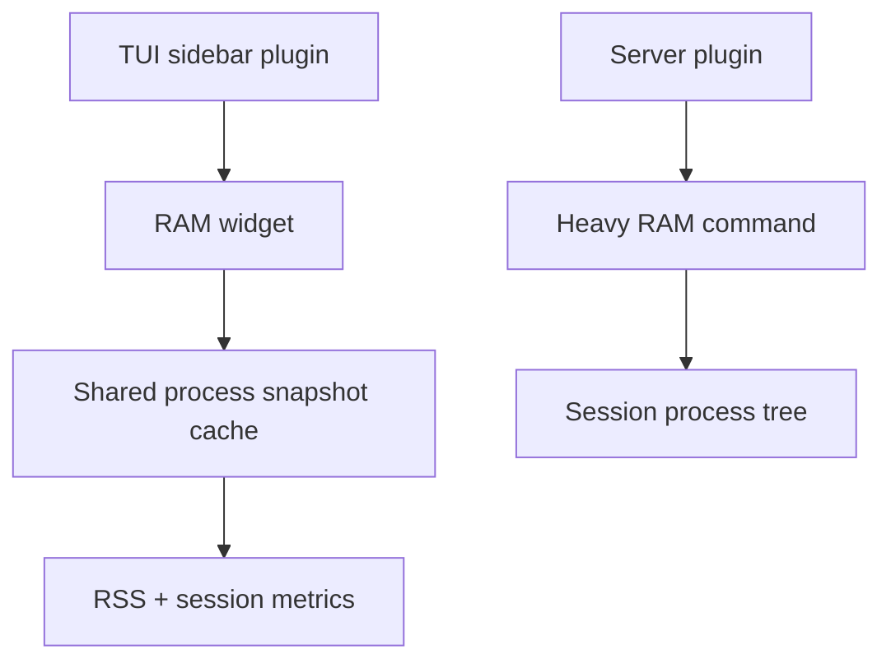

# opencode-ram-monitor

<p align="center">Zero-dependency RAM monitoring for OpenCode sessions</p>
<p align="center">
  <a href="https://www.npmjs.com/package/@capybearista/opencode-ram-monitor"></a>
  <a href="https://www.npmjs.com/package/@capybearista/opencode-ram-monitor"></a>
  <a href="https://opencode.ai"></a>
  <a href="https://opensource.org/licenses/MPL-2.0"></a>
</p>

---

## Why?

> This plugin gives developers real-time, zero-dependency insight into OpenCode session memory. The sidebar shows direct RSS and with-tools RSS for the current session and all sessions. The `/ram` command keeps the broader process-tree view.

## Philosophy: Extending OpenCode

OpenCode is designed to be highly extensible. This plugin uses both sides of the plugin model: the server hook captures `/ram`, and the TUI slot renders a compact sidebar card. It runs locally and falls back cleanly if process sampling fails.

### Architecture



Compact sidebar summary on the left. Full process tree on `/ram`.

## Features

- **Real-time Sidebar Widget**: View direct and with-tools RAM for the current session and all sessions in a compact OpenCode sidebar card.
- **Active Session Tracking**: Automatically discovers logical OpenCode sessions and aggregates their RAM.
- **Cross-Platform**: Uses native commands (`ps` on Unix, `wmic` on Windows) for lightweight zero-dependency metrics.
- **`/ram` Command**: Intercepts the `/ram` command to provide a detailed, heavy process-tree breakdown across all active OpenCode sessions right in the chat.
- **Configurable**: Polling intervals can be customized via `opencode.json`, `opencode.jsonc`, `tui.json`, `tui.jsonc`, and their `.opencode/` variants.

## Install

Add the plugin to `opencode.json` or `opencode.jsonc`:
```json
{
  "plugin": ["@capybearista/opencode-ram-monitor"]
}
```

Also, add the plugin to `tui.json` or `tui.jsonc`:
```json
{
  "plugin": ["@capybearista/opencode-ram-monitor"]
}
```

## Updating

Simply run the following command while no active OpenCode sessions are running:

```bash
rm -rf ~/.cache/opencode/packages/'opencode-ram-monitor@latest'/
```

The next time you open OpenCode, the new version will be installed!

## Usage

Once installed, the RAM monitor will automatically appear in your OpenCode TUI sidebar, polling your system to display direct and with-tools memory for the current session and the aggregate total across all active sessions.

To get a detailed heavy process tree of memory usage across all currently active OpenCode sessions, type `/ram` in your OpenCode chat.

## Configuration

Configure the plugin by adding `experimental.ramMonitor.refreshIntervalMs` to any supported OpenCode config file.

Supported config files, in load order:

1. `opencode.json` - global config
2. `tui.json` - global config
3. `.opencode/opencode.json` - project-local config
4. `.opencode/tui.json` - project-local config

If multiple files define the setting, later (child) files override earlier ones. A `ramMonitor.refreshIntervalMs` value configured in a project will override the one configured in the global config.

JSONC comments and trailing commas are supported.

| Property | Type | Default | Description |
| :--- | :--- | :--- | :--- |
| `experimental.ramMonitor.refreshIntervalMs` | `number` | `5000` | Polling interval for the sidebar widget in milliseconds. Clamped between `1000` and `60000`. |

Example:
```json
{
  "experimental": {
    "ramMonitor": {
      "refreshIntervalMs": 2000
    }
  }
}
```

## Troubleshooting

- **Widget missing from sidebar**: Ensure both the server and TUI plugins are registered in your OpenCode server and TUI config files.
- **Refresh interval did not change**: The widget reads `experimental.ramMonitor.refreshIntervalMs` from all supported `opencode.*` and `tui.*` config files, including `.opencode/` variants. Later files override earlier ones.
- **Config warning shown in the sidebar**: A supported config file could not be parsed, so the widget is using the last valid value it found or the default `5000ms` interval.
- **Active count seems off**: The plugin tokenizes command lines and parent links to find logical sessions. Deeply nested wrappers or unusual invocation aliases might still be missed.
- **Sidebar numbers look higher than expected**: The sidebar shows both direct RSS and with-tools RSS. The with-tools column includes child processes spawned by the session.
- **Total RAM shows `0`**: If sampling fails completely (e.g. `ps` is missing), the plugin falls back to using `process.memoryUsage().rss` of the current process. Ensure standard process utilities are available.

## Debug Logging

Debug logging is disabled by default. To enable diagnostic logs during development:

```bash
OPENCODE_RAM_MONITOR_DEBUG=1 opencode
```

When enabled, the plugin appends structured JSON log lines to `.opencode-ram-monitor.log` in the current working directory.

## Contributing

This package lives in the `opencode-plugins` monorepo.

- Run `bun run build`, `bun run typecheck`, `bun run lint`, and `bun test` before opening a PR.
- Keep the plugin focused on RAM monitoring logic.
- Prefer small, direct changes.

Please open an issue or check for existing ones before creating a pull request.

## License

[MPL-2.0](./LICENSE.txt)
